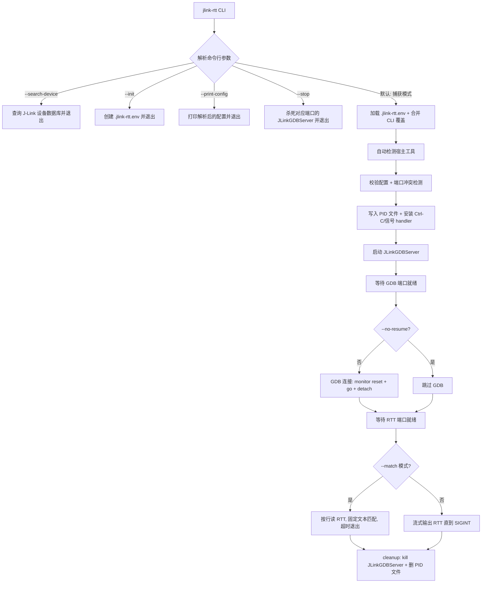

# J-Link RTT Rust 重写计划 (方案A - 进程编排)

该计划旨在将原 Linux Bash 脚本 [jlink_rtt.sh](file:///home/chub/.gemini/skills/jlink-rtt/scripts/jlink_rtt.sh) 重构为跨平台的 Rust 命令行工具，提供一致的多进程控制和 RTT 数据流处理。

---

## 1. 核心架构设计

Rust 工具将作为控制中心（Orchestrator），支持多种运行模式。主流程如下：

---

## 2. 关键依赖 Crate 选型

| 模块 | 原 Shell 工具/命令 | 推荐 Rust Crate | 说明 |
| :--- | :--- | :--- | :--- |
| **命令行解析** | `getopts` / 手动解析 | **`clap`** (derive) | 规范、强大的命令行参数及 `--help` 自动生成 |
| **配置读取** | `source` 配置文件 | **`dotenvy`** | 读取并解析 `.jlink-rtt.env` |
| **异步多任务/网络**| 后台进程 `&` + `nc` | **`tokio`** | 通过 `tokio::process` 与 `tokio::net::TcpStream` 实现异步非阻塞 I/O |
| **信号处理** | `trap` | **`tokio::signal`** | 跨平台 Ctrl-C 和 Unix 信号处理 |
| **进程管理** | `kill`, `wait`, `pkill` | **`sysinfo`** | 跨平台按命令行模式查找和杀死进程（用于 `--stop`） |

> **关于 USB 探测**：原脚本使用 `lsusb` 检测 J-Link 序列号。Rust 重写中**不使用 `rusb`**——该 crate 在 Windows 上需安装 libusb 驱动，与 J-Link 的 WinUSB 驱动冲突。替代方案为调用 `JLinkExe` 的命令行接口进行序列号探测，或直接留给用户通过 `--serial` 传入。USB 连接预检在 Linux 上可保留调用 `lsusb` 作为可选检查。
>
> **关于文本匹配**：原脚本的 `--match` 使用**固定文本子串匹配**（`[[ "$line" == *"$pattern"* ]]`），非正则表达式。Rust 中直接使用 `str::contains()` 即可，**不需要 `regex` crate**。

---

## 3. 核心模块划分

### 3.1 CLI & Config 模块

* 使用 `clap` derive 解析命令行参数（所有 `--` 选项一一对应原脚本）。
* 实现三层优先级：`命令行 > .jlink-rtt.env > 内置默认值`。
* `.jlink-rtt.env` 搜索逻辑：从当前目录向上遍历，**不超过 `--project-root` 或 git worktree root**（非 git 目录仅查当前目录）。
* 配置文件解析器：手动逐行解析 `KEY=VALUE`（支持注释、引号剥离），**不** 使用 `dotenvy` 的 `dotenv()` 自动注入环境变量，因为原脚本的配置只覆盖 known keys。

### 3.2 运行模式分派

根据 CLI 参数分派至不同模式（与 `main()` 流程一致）：

1. **`--search-device PATTERN`**：查询 J-Link 设备数据库，打印匹配结果并退出。
2. **`--init`**：创建 `.jlink-rtt.env` 配置文件。包含设备名模糊解析（调用 `JLinkExe ExpDevList`）。
3. **`--print-config`**：打印解析后的完整配置并退出（无需硬件/工具检测）。
4. **`--stop`**：按端口模式 kill 正在运行的 JLinkGDBServer 进程并退出。
5. **默认（捕获模式）**：完整的启动-连接-读取流程。

### 3.3 设备数据库模块

* 调用 `JLinkExe ExpDevList` 导出 CSV 格式的设备列表。
* 按 J-Link 版本缓存到 `/tmp`，避免重复导出。
* 实现三级匹配排序：精确匹配 > 前缀匹配 > 包含匹配。
* 用于 `--search-device`（交互查询）和 `--init`（自动解析）。

### 3.4 宿主工具检测模块

* 自动在 `PATH` 中搜索可用工具，按优先级尝试：
  * JLinkGDBServer: `JLinkGDBServer` → `JLinkGDBServerCLExe`
  * GDB: `gdb-multiarch` → `arm-none-eabi-gdb` → `gdb`
  * nc: `nc` → `ncat`
* 延迟检测：仅在实际需要硬件访问时执行（`--print-config` 无需检测）。
* 支持 CLI 覆盖：`--jlink-gdb-server`、`--gdb`、`--nc`。

### 3.5 Process Orchestrator 模块

* **GDB Server 守护**：利用 `tokio::process::Command` 启动 `JLinkGDBServer`。注册 `Drop`/信号 handler 保证当 Rust 进程退出（Ctrl+C、Panic 等）时子进程被 kill，防止端口残留。
* **端口就绪等待**：轮询 TCP 连接直到端口可达或超时，同时检测子进程是否意外退出。
* **端口冲突预检**：启动前检查 GDB/RTT 端口是否已被占用。
* **GDB 触发**：启动 GDB batch 进程，按 `--no-reset` / `--no-resume` 标志组合发送 `monitor reset` / `monitor go` / `detach` 命令。
* **PID 文件**：写入 `/tmp/jlink_rtt_<project>.pid`，供 `--stop` 使用，cleanup 时删除。

### 3.6 RTT Client 模块

* 建立 TCP 连接到 RTT Telnet 端口。
* **流式模式**（无 `--match`）：直接透传到 stdout，可选 tee 到 `--out` 文件，直到 SIGINT。
* **匹配模式**（有 `--match`）：按行读取，对每行执行 `str::contains()` 固定文本匹配，匹配成功或超时（`--match-timeout`）退出。
* 同样支持 `--out` 文件输出。

---

## 4. CLI 参数完整清单

以下参数需与原脚本 1:1 对应：

| 参数 | 类型 | 默认值 | 说明 |
| :--- | :--- | :--- | :--- |
| `--config FILE` | PathBuf | 自动搜索 | 显式指定 .jlink-rtt.env 路径 |
| `--project-root DIR` | PathBuf | git root / cwd | 限定配置搜索范围 |
| `--print-config` | flag | - | 打印配置并退出 |
| `--init` | flag | - | 创建配置文件并退出 |
| `--stop` | flag | - | 停止运行中的 RTT 会话 |
| `--search-device PATTERN` | String | - | 查询设备数据库 |
| `--jlink-gdb-server CMD` | String | 自动检测 | 覆盖 JLinkGDBServer 命令 |
| `--gdb CMD` | String | 自动检测 | 覆盖 GDB 命令 |
| `--nc CMD` | String | 自动检测 | 覆盖 nc 命令 |
| `--device DEVICE` | String | 从配置读取 | J-Link 目标设备名 |
| `--if INTERFACE` | String | `SWD` | J-Link 接口 |
| `--speed KHZ` | u32 | `4000` | J-Link 速率 |
| `--serial SERIAL` | String | - | J-Link 序列号 |
| `--host HOST` | String | `127.0.0.1` | 本地主机地址 |
| `--gdb-port PORT` | u16 | `2331` | GDB 服务端口 |
| `--rtt-port PORT` | u16 | `19021` | RTT Telnet 端口 |
| `--timeout SECONDS` | u32 | `10` | 端口就绪超时 |
| `--log FILE` | PathBuf | `/tmp/jlink_gdb_server.log` | GDB Server 日志 |
| `--gdb-log FILE` | PathBuf | `/tmp/jlink_gdb_resume.log` | GDB 操作日志 |
| `--out FILE` | PathBuf | - | RTT 输出文件 |
| `--match PATTERN` | String | - | 固定文本匹配退出 |
| `--match-timeout SEC` | u32 | `30` | 匹配超时 |
| `--no-reset` | flag | - | 不复位目标芯片 |
| `--no-resume` | flag | - | 不通过 GDB 恢复运行 |

---

## 5. 实施步骤与开发里程碑

* [ ] **Milestone 1: 项目脚手架与参数解析**
  * 初始化 Cargo 项目，引入 `clap`、`tokio`、`dotenvy`。
  * 实现完整 CLI 参数定义（上表所有参数）。
  * 实现 `.jlink-rtt.env` 搜索（向上遍历 + project root 边界）和解析。
  * 实现三层配置合并逻辑。
  * 实现 `--print-config` 模式。

* [ ] **Milestone 2: 设备数据库与 `--init` 模式**
  * 实现 `JLinkExe ExpDevList` 调用与 CSV 缓存解析。
  * 实现设备名模糊搜索（精确/前缀/包含三级排序）。
  * 实现 `--search-device` 模式。
  * 实现 `--init` 模式（设备名解析 + 写入 `.jlink-rtt.env`）。

* [ ] **Milestone 3: 宿主工具检测与预检**
  * 实现 PATH 中多候选工具自动检测（JLinkGDBServer / GDB / nc）。
  * 实现端口冲突预检。
  * 实现 USB 连接预检（Linux 可选调用 `lsusb`，其他平台跳过）。
  * 实现配置校验逻辑。

* [ ] **Milestone 4: 进程生命周期与 GDB 触发**
  * 实现 JLinkGDBServer 异步启动与子进程管理。
  * 实现端口就绪轮询（含子进程存活检测）。
  * 实现 GDB batch 触发（reset/go/detach，尊重 `--no-reset` / `--no-resume`）。
  * 实现 PID 文件写入与 cleanup（`Drop` + 信号 handler）。
  * 实现 `--stop` 模式（按端口模式 pkill）。

* [ ] **Milestone 5: RTT 流读取与匹配退出**
  * 实现 TCP 连接到 RTT 端口。
  * 实现流式模式（透传 stdout + 可选 tee 到文件）。
  * 实现匹配模式（固定文本 `contains` + `--match-timeout`）。
  * 信号中断时的优雅退出。

* [ ] **Milestone 6: 跨平台兼容性测试与打包分发**
  * Linux / macOS / Windows 测试。
  * 处理平台差异（信号、进程 kill、路径分隔符等）。
  * 构建 CI + 发布二进制。
